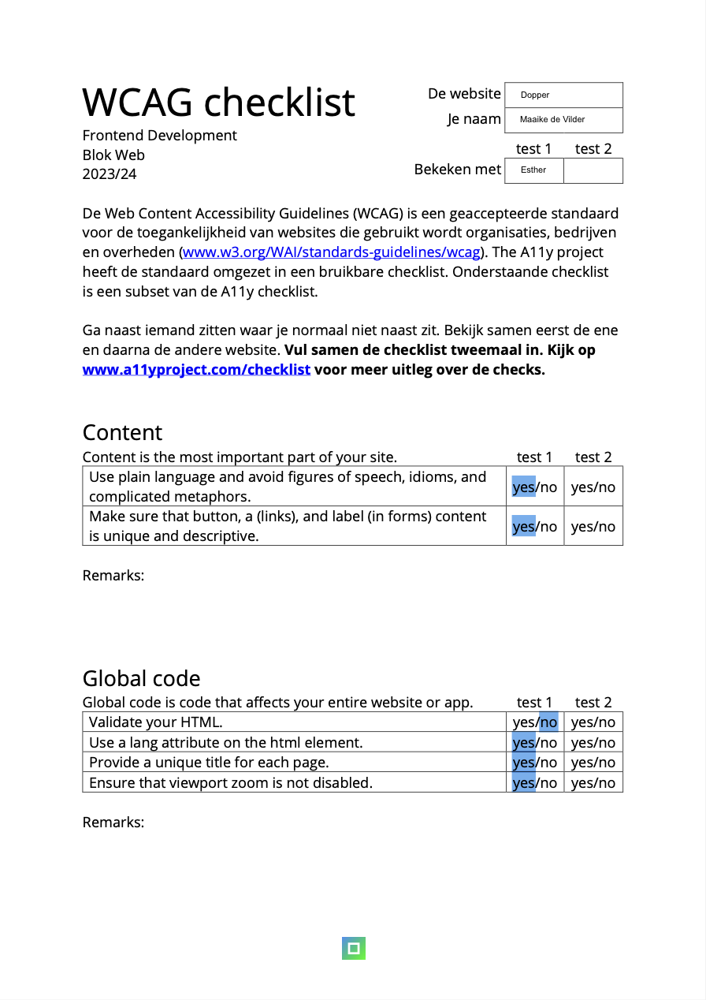
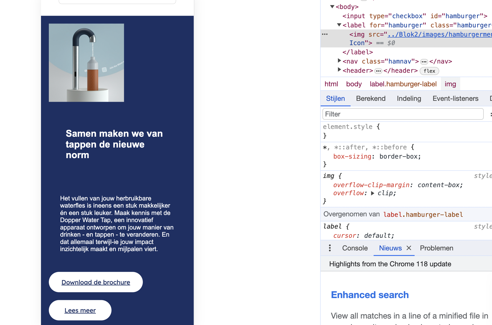
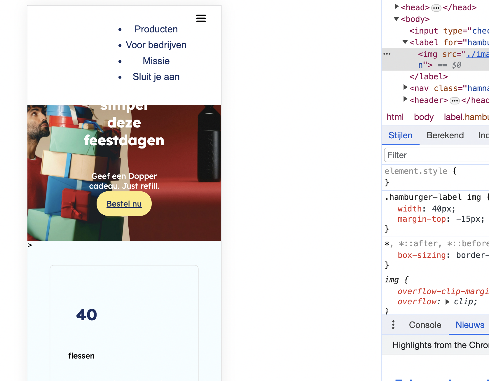

# Procesverslag
Markdown is een simpele manier om HTML te schrijven.  
Markdown cheat cheet: [Hulp bij het schrijven van Markdown](https://github.com/adam-p/markdown-here/wiki/Markdown-Cheatsheet).

Nb. De standaardstructuur en de spartaanse opmaak van de README.md zijn helemaal prima. Het gaat om de inhoud van je procesverslag. Besteedt de tijd voor pracht en praal aan je website.

Nb. Door *open* toe te voegen aan een *details* element kun je deze standaard open zetten. Fijn om dat steeds voor de relevante stuk(ken) te doen.

## Jij

  
uitwerken voor kick-off werkgroep

  ### Auteur:
 Maaike de Vilder

  #### Je startniveau:
 Blauw

  #### Je focus:
  hier je focus (kies uit responsive óf surface plane) : Surface plane
 

## Je website

  
uitwerken voor kick-off werkgroep

  ### Je opdracht:
  https://dopper.com/nl?_gl=1*boh6cs*_ga*MTY0Mjk4MjQzMC4xNjk5OTQ5MzU5*_ga_CCQ8WWERJQ*MTY5OTk0OTM1OC4xLjEuMTY5OTk0OTY2My41OC4wLjA. 

  #### Screenshot(s) van de eerste pagina (small screen): 
Hompagina van Dopper
 
 

  #### Screenshot(s) van de tweede pagina (small screen):
  Dopperproducten
  
 

## Toegankelijkheidstest 1/2 (week 1)

  
uitwerken na test in 2e werkgroep

Voice over werkt niet goed, leest niet als eerst de titel voor!

    
  ### Bevindingen
  Lijst met je bevindingen die in de test naar voren kwamen:

  

## Breakdownschets (week 1)

  
uitwerken na afloop 3e werkgroep

  ### de hele pagina: 
   

  ### dynamisch deel (bijv menu): 
  

  ### wellicht nog een dynamisch deel (bijv filter): 
  

## Voortgang 1 (week 2)

  
uitwerken voor 1e voortgang

  ### Stand van zaken
  hier dit ging goed & dit was lastig (neem ook screenshots op van delen van je website en code)

  ### Agenda voor meeting

  Feedback 

  - Geen h1,h2,h3 onder elkaar gebruiken maar gebruik voor je voorpagina H2 & p
  - head boven de body neerzetten
  - geen gebruik maken van de Div
  - Gebruik 1 link voor de font google 300,400 bijv. 

  ### Verslag van meeting
  hier na afloop snel de uitkomsten van de meeting vastleggen

  - punt 1
  - punt 2
  - nog een punt
  - ...

## Voortgang 2 (week 3)

  
uitwerken voor 2e voortgang

  ### Stand van zaken
  

  ### Agenda voor meeting
 

  ### Verslag van meeting
  hier na afloop snel de uitkomsten van de meeting vastleggen

  - punt 1
  - punt 2
  - nog een punt
- ...

## Toegankelijkheidstest 2/2 (week 4)

  
uitwerken na test in 9e werkgroep

  ### Bevindingen
 
 
  

  Alles ging in de war.

## Voortgang 3 (week 4)

  
uitwerken voor 3e voortgang

  
  
  

  Lang naar de code gekeken en mijn oude code weer teruggevonden. Ik heb het gelukkig weer rechts kunnen krijgen. De div zit er wel weer hier in. 

  ### Stand van zaken
  

  ### Agenda voor meeting
  samen met je groepje opstellen

 

  ### Verslag van meeting
  hier na afloop snel de uitkomsten van de meeting vastleggen

  - punt 1
  - punt 2
  - nog een punt
  - ...

## Eindgesprek (week 5)

  
uitwerken voor eindgesprek

  ### Je uitkomst - karakteristiek screenshots:
  

  ### Dit ging goed/Heb ik geleerd: 
  Korte omschrijving met plaatjes

  

  ### Dit was lastig/Is niet gelukt:
  Korte omschrijving met plaatjes

  

## Bronnenlijst

  
continu bijhouden terwijl je werkt

  Nb. Wees specifiek ('css-tricks' als bron is bijv. niet specifiek genoeg). 
  Nb. ChatGpT en andere AI horen er ook bij.
  Nb. Vermeld de bronnen ook in je code.

  ( ChatGpT )

  1.   html aria-label="Verkooppunten en contactinformatie"> <!-- extra context voor mensen met een beperking-->
  2. left: -22%; /* Voeg deze regel toe om de afbeelding naar links te verschuiven */
  3. /* Mediaquery voor kleinere schermen */
@media (max-width: 600px) {
    .hamburger-label {
        display: block;
    }
  4.  z-index: 2; /* Geef het hamburgermenu een z-index van 2, dezelfde als de header */
  5. .logo-text {
    /* verbergen van de h1 */}
    6. javascript deel

grid  

grid-template-columns ; repeat (auto-fill, minmax(20em, 1fr))